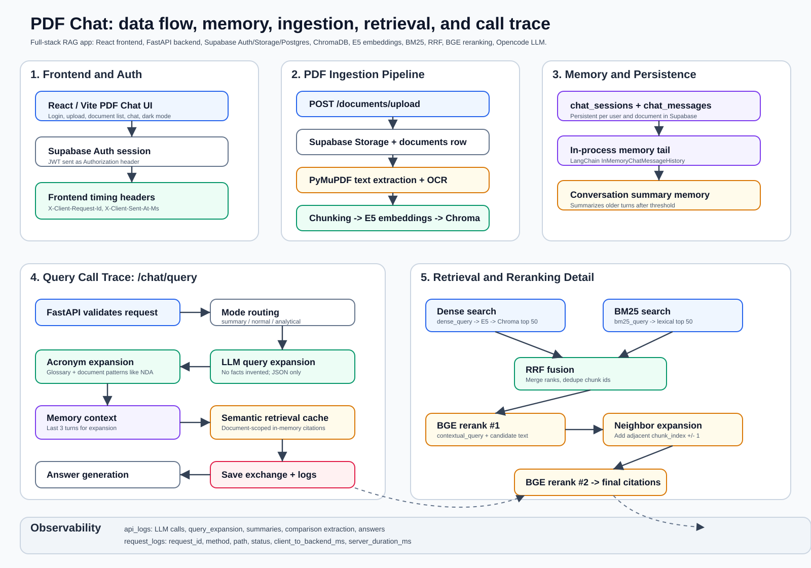

# PDF Chat

[](https://github.com/yashjadwani/chat-with-pdf/actions/workflows/ci.yml)

I built this as a production-shaped RAG system for grounded question answering
over PDFs. The part I care most about is the retrieval pipeline: hybrid dense +
lexical search, RRF fusion, two-stage cross-encoder reranking, and neighbor-chunk
expansion — which I tuned against the constant tension between answer quality and
latency. I kept everything citation-first: answers point back to the exact pages
they came from.

**Engineering highlights**

- Hybrid retrieval: dense (E5) + BM25 fused with Reciprocal Rank Fusion, so
  incompatible raw scores are never compared directly.
- Two-stage BGE cross-encoder reranking with neighbor-chunk expansion between
  the passes.
- LLM query expansion (contextual / lexical / dense rewrites) with graceful
  fallback on timeout or invalid JSON.
- Latency work throughout: in-memory BM25 payloads, a semantic retrieval cache,
  and background reranker warm-up on startup.
- Reproducible evaluation: a dense-only vs. hybrid retrieval ablation plus an
  LLM-as-judge faithfulness check on answers (see [Evaluation](#evaluation)).
- Unit-tested retrieval math (RRF fusion, neighbor expansion, metrics) running
  in CI on every push.
- Full observability: per-call LLM logs and per-request timing logs.



## What It Does

- Authenticates users with Supabase email/password auth.
- Uploads PDFs to a private Supabase Storage bucket.
- Extracts selectable PDF text with PyMuPDF.
- Runs OCR with Tesseract on low-text or image-heavy pages.
- Chunks pages, embeds chunks with `intfloat/multilingual-e5-small`, and stores raw text + embeddings + metadata in ChromaDB.
- Answers questions with hybrid retrieval, query expansion, reranking, neighbor chunk expansion, memory, and citation-aware LLM prompts.
- Saves chat history per user/document and logs LLM calls, query expansion calls, request timings, and latency metadata.

## Stack

| Layer | Tech |
| --- | --- |
| Frontend | Vite, React, TypeScript, Supabase JS, Lucide icons |
| Backend | FastAPI, Pydantic, Uvicorn |
| Auth | Supabase Auth |
| Database | Supabase Postgres |
| Storage | Supabase Storage |
| Vector store | ChromaDB persistent storage |
| PDF/OCR | PyMuPDF, Tesseract, pytesseract, Pillow |
| Embeddings | `intfloat/multilingual-e5-small` |
| Retrieval | Chroma dense search, BM25, RRF, BGE reranking, neighbor expansion |
| LLM | Opencode API |
| Deployment | Modal backend, Vercel-style frontend |

## Current Pipeline

### Ingestion

```text
PDF upload
-> Supabase Storage
-> documents row: processing
-> PyMuPDF page text extraction
-> OCR fallback when page text is low or image-heavy
-> RecursiveCharacterTextSplitter
-> E5 embeddings with "passage:" prefix
-> Chroma stores raw chunk text, embeddings, metadata, ids
-> documents row: ready
```

Important detail: embeddings are never converted back into text. Chroma stores the original chunk text alongside the vector, then returns the stored text after vector search.

### Chat Query Call Trace

```text
POST /chat/query
-> Supabase JWT validation
-> document ownership/status/embedding checks
-> question validation
-> chat session load/create
-> mode routing
   -> summary
   -> normal Q&A
   -> comparison/ranking
```

Normal and comparison queries:

```text
question
-> acronym expansion
-> recent chat history lookup
-> LLM query expansion
   -> contextual_query
   -> bm25_query
   -> dense_query
-> semantic retrieval cache lookup
-> dense Chroma retrieval using dense_query
-> BM25 lexical retrieval using bm25_query
-> RRF fusion and dedupe
-> BGE rerank #1 using contextual_query
-> neighbor chunk expansion
-> BGE rerank #2
-> final citations
-> optional query-term citation filter
-> LLM answer generation
-> save chat messages
-> write logs
```

Summary queries skip normal retrieval and use representative chunks across the document.

Comparison/ranking queries retrieve more context, extract structured facts, rank in Python, then generate the final grounded answer.

## Query Expansion

The app has two expansion layers:

- Deterministic acronym expansion from a global glossary and document patterns like `Long Form (ABC)`.
- Lightweight LLM query expansion for non-summary chat queries.

The LLM expansion is instructed only to rewrite search intent:

```text
Do not answer the user's question.
Do not invent facts, dates, names, clauses, obligations, amounts, page numbers, or conclusions.
```

It returns JSON:

```json
{
  "contextual_query": "Query with references resolved from recent chat history.",
  "bm25_query": "Keyword-rich query for exact lexical retrieval.",
  "dense_query": "Broader conceptual query for vector retrieval."
}
```

If expansion fails, times out, or returns invalid JSON, retrieval falls back to the acronym-expanded query.

## Retrieval and Caching

- Dense retrieval embeds the `dense_query` with the E5 `query:` prefix and searches Chroma.
- BM25 retrieves lexical matches from Chroma-stored raw chunks.
- BM25 payloads are cached in memory with `lru_cache`.
- RRF combines dense and BM25 rankings without comparing incompatible raw scores.
- BGE reranking scores `(query, chunk_text)` pairs.
- Neighbor expansion adds adjacent chunks around the strongest reranked chunks.
- A second BGE rerank decides whether those neighbor chunks belong in final citations.
- Semantic retrieval cache stores document-scoped query embeddings and final citations in memory.

Semantic cache scope:

```text
document_id + final_top_k + query_embedding similarity
```

It does not cache final LLM answers.

## Memory

Memory is configured in two layers:

- Persistent memory in Supabase `chat_sessions` and `chat_messages`.
- In-process memory through LangChain `InMemoryChatMessageHistory`.

When chat history grows beyond the configured threshold, older turns are summarized and recent turns are kept as the live tail. Query expansion uses the last 3 turns directly so it can resolve follow-up wording before retrieval.

## Observability

- `api_logs` stores LLM/provider calls: chat answers, query expansion, memory summaries, document summaries, comparison extraction, and comparison answers.
- `request_logs` stores HTTP request timings: request id, method, path, status, client-to-backend duration, and backend server duration.
- The frontend also logs request timing in the browser console with the same request id.
- The backend warms the BGE reranker in the background on startup so the first user query is less likely to pay the model load cost.

## Evaluation

I measure retrieval quality with a small gold set rather than by eyeballing
logs. `backend/eval/` runs each question through two retrievers and reports
`Hit@k`, `MRR@k`, and page `Recall@k` for both:

- **baseline** — naive dense-only vector search.
- **pipeline** — the full hybrid retriever (dense + BM25 → RRF → BGE rerank →
  neighbor expansion → BGE rerank).

The comparison is the whole point for me: it shows whether the extra retrieval
machinery earns its latency versus plain dense search.

```bash
cd backend
python -m eval.run --k 5
```

Results on the local gold set (7 cases, one 34-page document):

| Metric | Dense-only | Hybrid pipeline |
| --- | --- | --- |
| Hit@5 | 1.00 | 1.00 |
| MRR@5 | 0.93 | 0.93 |
| Recall@5 | 1.00 | 1.00 |

My honest takeaway right now: on this small factual gold set both retrievers
saturate, so the extra hybrid machinery isn't differentiating yet — the per-case
rows show the reranker helping on one question and hurting on another. My next
step is harder cases (paraphrased questions with no lexical overlap, multi-page
answers) where dense-only should start missing.

Answer quality on the same set: faithfulness 5.0/5, relevance 5.0/5, 0/6
answers with unsupported claims (1 of 7 judge outputs unparseable — LLM-as-judge
is noisy, and I made the parser refuse to guess).

I added a second layer that evaluates the **answer** rather than the retrieval:
`eval/judge.py` runs each question through the real answer path and has an LLM
judge score faithfulness (are all claims supported by the retrieved context?)
and relevance (1–5 each), quoting any unsupported claims verbatim.

```bash
python -m eval.judge --k 5
```

Building a gold set and the metric definitions are documented in
[`backend/eval/README.md`](backend/eval/README.md).

## Testing

My unit tests cover the deterministic core of the pipeline — RRF fusion math,
neighbor-chunk expansion, acronym expansion, query-term filtering, eval
metrics, and judge-output parsing:

```bash
cd backend
pip install -r requirements-dev.txt
python -m pytest tests/ -v
```

GitHub Actions runs the backend tests and a frontend type-check + build on
every push (`.github/workflows/ci.yml`).

## Local Development

Backend:

```bash
cd backend
py -m venv .venv
.venv\Scripts\activate
pip install -r requirements.txt
uvicorn app.main:app --reload --port 8000
```

Frontend:

```bash
cd frontend
npm install
npm run dev
```

URLs:

```text
Backend:  http://localhost:8000
Frontend: http://localhost:5173
```

## Required Services

- Supabase project
- Supabase private storage bucket named `chat-with-pdf`
- Supabase schema from `backend/schema.sql`
- Opencode API key
- Optional LangSmith key
- Tesseract installed locally if OCR is enabled outside Modal

## Project Structure

```text
chat-with-pdf/
  backend/
    app/
      api/
      core/
      db/
      models/
      services/
    eval/
    tests/
    modal_app.py
    requirements.txt
    requirements-dev.txt
    schema.sql
  frontend/
    src/
      components/
      lib/
      types/
      App.tsx
      styles.css
  docs/
    project-architecture.svg
```

## Deployment Notes

- Backend deploys with `backend/modal_app.py`.
- Modal installs Python requirements and `tesseract-ocr`.
- Chroma persists on a Modal volume.
- Frontend can deploy to Vercel or similar.
- Configure Supabase email redirects to the deployed frontend `/app` route.
